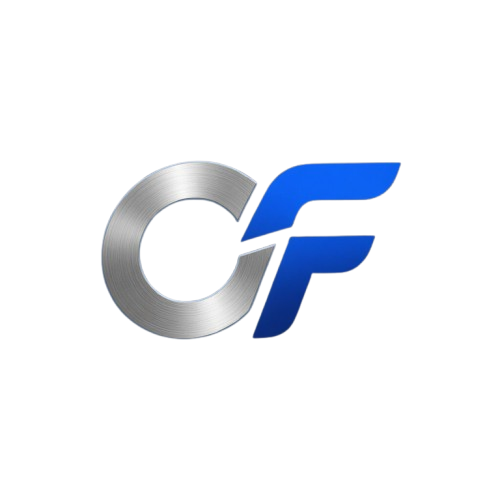

  
  
  # OddsFactory
  
  **Turn Booking Codes Into Better Opportunities**
  
  
  
  
  

  *Built for smarter betting, not blind betting.*

---

## 🚀 What is OddsFactory?

**OddsFactory** is an AI-powered betting optimization platform built specifically for SportyBet users. 

Instead of playing risky booking codes blindly, OddsFactory analyzes every selection and intelligently rebuilds your slip based on your preferred strategy. Whether your goal is higher win probability, better expected value, or specific target odds, OddsFactory helps you optimize before you stake.

---

## 🎯 Optimization Modes

| Mode | Description | Strategy |
| :--- | :--- | :--- |
| **🟢 Balanced** | Better stability while maintaining attractive odds. | Swap high-risk legs. |
| **🛡️ Safe** | Maximum focus on win probability. | Extreme risk reduction. |
| **❤️ Survival** | Keeps only the strongest selections. | Trimming the fat. |
| **📈 Best EV** | Prioritizes expected value opportunities. | Math-based advantage. |
| **🎯 Target Odds** | Optimizes around your desired odds range. | Controlled payouts. |
| **🚀 Dreamer** | Preserves big-win potential while reducing unnecessary risk. | High-reward potential. |

---

## ⚡ How To Use (Novice Friendly)

### 1. Visit the Platform
Navigate to the live site: [https://oddsfactorybetsai.vercel.app/](https://oddsfactorybetsai.vercel.app/)

### 2. Paste Your Booking Code
Enter your SportyBet code (e.g., `RSF4H3`) into the import box.

### 3. Choose Your Goal
Select the strategy that matches your betting style (Safe, Balanced, etc.).

### 4. Review AI Changes
Check the **Optimization Log** to see exactly what was changed:
- ✅ **Markets kept**
- 🔄 **Markets improved**
- ❌ **Markets removed**

### 5. Generate Your New Code
Click the button to receive a fresh, optimized SportyBet booking code ready to use immediately.

---

## 📊 Features

- **🤖 AI Slip Optimization:** Intelligent rebuilding of betting tickets.
- **📈 Risk Analysis:** Real-time evaluation of every leg.
- **💰 Expected Value Evaluation:** Identifying the best mathematical opportunities.
- **🔄 Market Replacement Engine:** Swapping risky picks for higher-probability ones.
- **📋 Optimization Logs:** Full transparency on AI decision-making.
- **📱 Mobile-Friendly Interface:** Fast and responsive on any device.
- **⚡ Fast Processing:** Get optimized codes in seconds.

---

## 🛠️ Technical Setup (For Developers)

### Production Mode
The application is live and managed via **Vercel**. No installation or downloads are required for general users.

### Local Development
To run the project locally on your machine:
1. **Clone the Repo:** `git clone https://github.com/your-username/oddsfactory.git`
2. **Install Dependencies:** `npm install`
3. **Run Dev Server:** `npm run dev`

---

## ⚠️ Disclaimer

OddsFactory provides analytical assistance only. No optimization strategy can guarantee winnings. Sports betting involves risk. Always bet responsibly and never stake more than you can afford to lose.

---

  <h3>OddsFactory 🎯</h3>
  
<i>Turn Booking Codes Into Better Opportunities</i>

